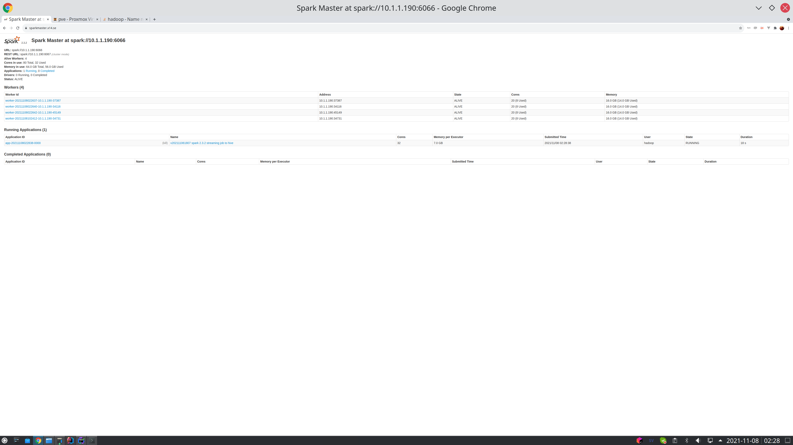
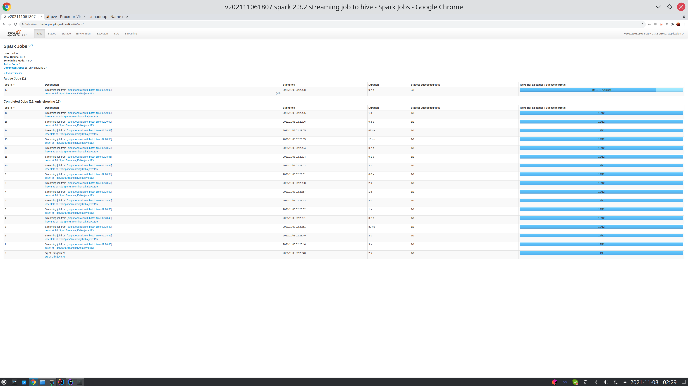
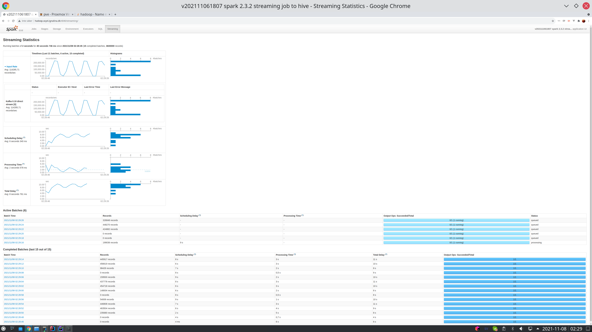
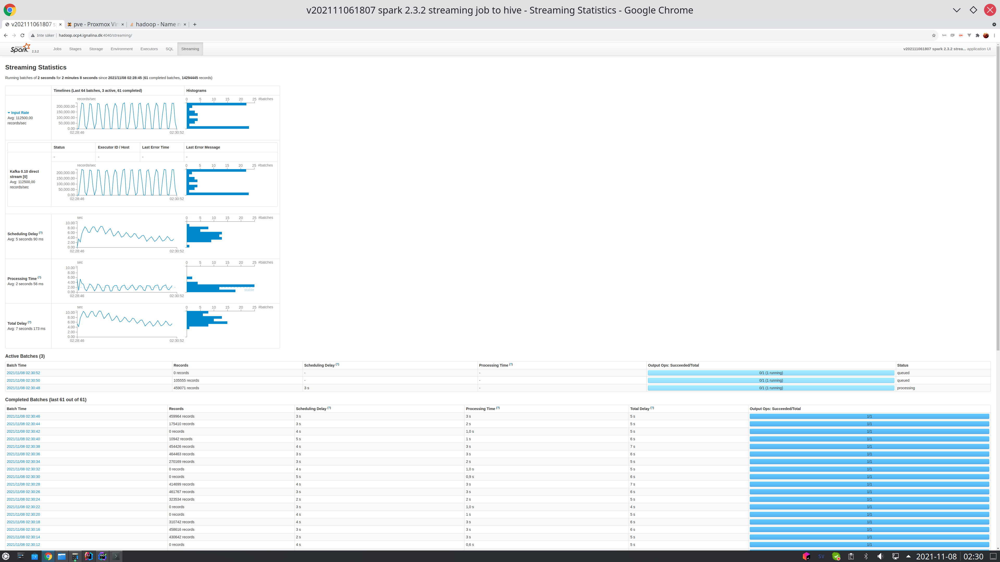

# Welder 2022
Trying out different streaming jobs to read avro from kafka and output to targets like :
*  Append only: hive/parquet  
*  full sync: Iceberg/parquet.
*  full sync: Delta
*  full sync: hudi

Goals with this is to learn howto read from kafka with multiple partitions/offsets and spread out the work to multiple workers.
The name Welder is the opposite from the Shredder , since the welder it makes the data "whole again" (Hopefully)

# Screenshots
An producer called the Shredder is started  , reading fixed column sized datafiles (30 columns in this example , 2 gig per file).  

Time spend in total     : 2.471591492s  parsing  148804290  lines from  2620609413  bytes  
Troughput bytes/s total : 1011.17MB /s  
Troughput lines/s total : 57.42M  Lines/s  
Troughput lines/s toAvro: 4.27M  Lines/s  
Time spent toReadChunks : 0.7911964744166666 s  
Time spent toAvro       : 33.271536043333334 s  
Time spent toKafka      : 19.226326717666666 s  
Time spent DoneKafka      : 8.036e-06 s  

  
  
  
  

